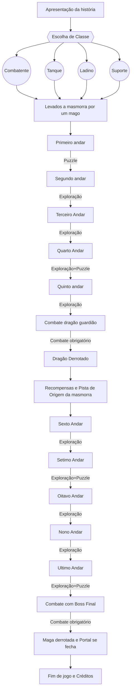

#  Fluxograma da Aventura de RPG

```mermaid
flowchart TD
A[Apresentação da história]
B{{Escolha de Classe}}
C((Combatente))
D((Tanque))
E((Ladino))
F((Suporte))
G[Levados a masmorra por um mago]
K[Combate dragão guardião]
L[Dragão Derrotado]
M[Recompensas e Pista de Origem da masmorra]
O[Combate com Boss Final]
P[Maga derrotada e Portal se fecha]
T[Fim de jogo e Créditos]
H[Primeiro andar]
I[Segundo andar]
U[Terceiro Andar]
V[Quarto Andar]
J[Quinto andar]
W[Sexto Andar]
X[Setimo Andar]
Y[Oitavo Andar]
Z[Nono Andar]
N[Ultimo Andar]

  A --> B;
  B --> C;
  B --> D;
  B --> E;
  B --> F;
  C --> G;
  D --> G;
  E --> G;
  F --> G;
  G --> H;
  H -- Puzzle --> I;
  I -- Exploração --> U;
  U -- Exploração --> V;
  V -- Exploração+Puzzle --> J;
  J -- Exploração --> K;
  K -- Combate obrigatório --> L;
  L --> M;
  M --> W;
  W -- Exploração --> X;
  X -- Exploração+Puzzle --> Y;
  Y -- Exploração --> Z;
  Z -- Exploração --> N;
  N -- Exploração+Puzzle --> O;
  O -- Combate obrigatório --> P;
  P --> T;
```
